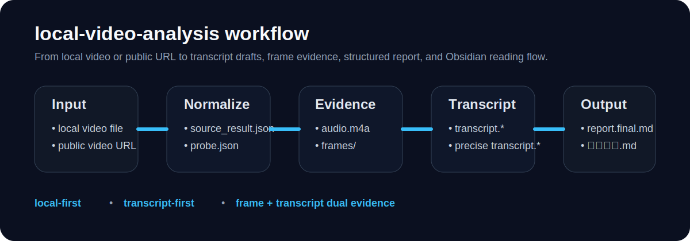
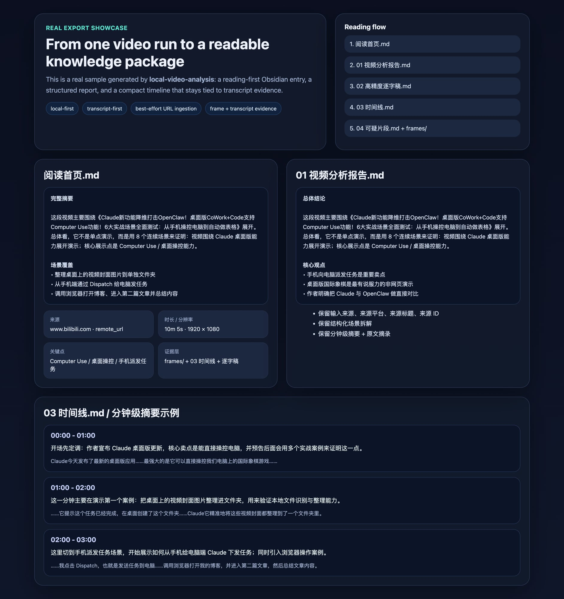
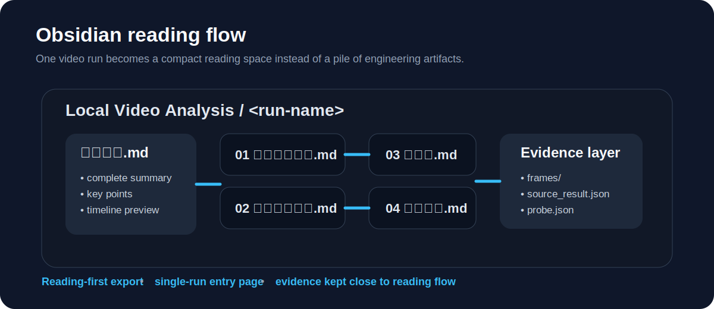

# local-video-analysis

A local-first, transcript-first workflow for turning local videos or publicly accessible video URLs into precise transcript drafts, frame evidence, and structured summaries.

> Supports local video files and best-effort URL ingestion for publicly accessible video sources.

`local-video-analysis` 不是一个“吐一段摘要就结束”的视频工具。它的目标是把教程、录屏、技术讲解这类视频，整理成一套 **可复核、可继续加工、可沉淀进知识库** 的分析材料。

## At a glance

- **Input**: local video file / public video URL
- **Core idea**: transcript first, then summary with frame evidence
- **Outputs**: transcript, timeline, frames, report, Obsidian reading entry
- **Best for**: tutorials, walkthroughs, screen recordings, technical explainers



## Why this project

很多视频分析流程的问题，不是“不能出摘要”，而是：

1. 太依赖云端服务
2. 只有结论，没有可追溯的逐字稿基础
3. 很难把视频内容沉淀成可复查、可继续加工的知识

这个项目的核心思路是：

> 先尽量把视频转成高质量逐字稿草案，再结合画面做结构化总结。

所以它更强调：
- local-first
- transcript-first
- frame + transcript dual evidence
- tutorial / recording oriented
- built for iterative precision improvement

## Why it is not just another video summarizer

它不是“看几帧然后输出一段总结”的轻量摘要器，而是把视频拆成多层可复核结果：

| Layer | What it preserves | Why it matters |
|---|---|---|
| Transcript | 原话基础 | 方便回查、纠错、提取术语 |
| Timeline | 时间结构 | 方便定位步骤、还原流程 |
| Frames | 画面证据 | 方便核对 UI、配置、操作状态 |
| Report | 结构化结论 | 方便快速理解视频主线 |
| Obsidian reading flow | 阅读入口 | 方便沉淀成长期可用知识 |

如果你的目标是：
- 复盘教程
- 提取配置步骤
- 回看录屏里的关键操作
- 把视频变成可继续整理的知识材料

这条路线会比“只要一段摘要”更有用。

## What it can do now

当前已经支持：
- 分析本地视频文件
- best-effort 分析公开可访问的视频 URL
- 统一产出转写、时间线、报告、关键帧和 Obsidian 阅读入口
- 为后续人工复核、知识沉淀、二次总结提供稳定底座

适合的输入类型：
- 本地视频文件
- 公开视频页面 URL
- 直链媒体 URL

当前最稳定的路径仍然是：
- 本地视频文件
- 公开可访问的媒体 URL / 视频页面

## Typical use cases

这个项目尤其适合：

- **教程视频复盘**：把长视频拆成逐字稿、时间线和重点结论
- **配置演示拆解**：保留每一步讲解和画面证据，方便回查
- **本地开发录屏归档**：把录屏沉淀成可以继续整理的资料
- **产品操作流程梳理**：既保留结果，也保留过程和证据
- **技术讲解内容整理**：方便后续写笔记、文档、报告或知识卡片

## Workflow at a glance

```text
video file / public URL
        ↓
source normalization
        ↓
audio + probe + frames
        ↓
transcript + precise transcript
        ↓
report.stub.md + report.final.md
        ↓
Obsidian 阅读首页 + 逐字稿 + 时间线 + 可疑片段
```

## What you get

运行一次分析后，通常会得到这些层次化结果：

```text
runs/<video-run>/
├── source_result.json
├── probe.json
├── report.stub.md
├── report.final.md
├── frames/
├── audio.m4a
├── transcript.clean.md
├── transcript.timeline.md
└── precise/
    ├── precise_transcript.clean.md
    ├── precise_transcript.timeline.md
    └── suspicious_segments.md
```

关键产物包括：
- `source_result.json`：输入来源与解析结果
- `probe.json`：时长、分辨率等视频元信息
- `frames/`：关键帧证据
- `audio.m4a`：导出的音频
- `transcript.clean.md` / `transcript.timeline.md`：基础转写与时间线
- `precise/precise_transcript.clean.md` / `precise/precise_transcript.timeline.md`：高精度逐字稿草案
- `precise/suspicious_segments.md`：可疑片段复核清单
- `report.stub.md` / `report.final.md`：结构化报告草稿与正式报告

## Reading experience after export

导出到 Obsidian 后，会变成更适合阅读的结构：

```text
<ObsidianVault>/
└── Local Video Analysis/
    └── <run-name>/
        ├── 阅读首页.md
        ├── 01 视频分析报告.md
        ├── 02 高精度逐字稿.md
        ├── 03 时间线.md
        ├── 04 可疑片段.md
        ├── source_result.json
        ├── probe.json
        └── frames/
```

### Real sample preview





当前导出策略已经收敛成：
- 不再强调 vault 级首页
- 每条视频目录里的 `阅读首页.md` 是真正入口
- `阅读首页.md` 默认排在 `01 视频分析报告.md` 前面
- `01 视频分析报告.md`、`02 高精度逐字稿.md`、`03 时间线.md`、`04 可疑片段.md` 作为正式阅读链路

这让 Obsidian 更像阅读空间，而不是工程产物目录。

## Capability boundary

当前版本最适合：
- 教程视频
- 录屏视频
- 产品/工具演示
- 配置过程复盘
- 本地开发过程记录

当前版本已经比较稳定的是：
- 高质量自动逐字稿草案
- URL / 本地文件统一入口
- 结构化报告生成
- Obsidian 阅读导出

当前版本仍然保持保守预期：
- 更像“高质量自动草案”，不是正式发布级字幕
- 仍建议保留人工复核
- URL ingestion 是 best-effort，不宣称支持所有视频平台

## Start here

如果你第一次进仓库，建议按这个顺序看：

1. `docs/install.md`
2. `docs/quickstart.md`
3. `docs/workflow.md`
4. `docs/url-inputs.md`
5. `docs/obsidian-integration.md`
6. `examples/outputs.md`

## Quick start

主入口：
- `scripts/analyze_video.sh`

兼容入口：
- `scripts/analyze_local_video.sh`（wrapper，保留兼容，不再作为主推荐）

分析本地视频：

```bash
bash scripts/analyze_video.sh /path/to/video.mp4 30
```

分析公开视频 URL：

```bash
bash scripts/analyze_video.sh "https://example.com/video-page" 30
```

需要浏览器 cookies 时：

```bash
LVA_COOKIES_FROM_BROWSER=chrome bash scripts/analyze_video.sh "https://example.com/video-page" 30
```

导出到 Obsidian：

```bash
python3 scripts/export_to_obsidian.py --run-dir ./runs/<video-run> --vault-dir /path/to/your/ObsidianVault
```

## Docs map

- `docs/install.md` — 安装依赖与环境检查
- `docs/quickstart.md` — 最快跑通主流程
- `docs/workflow.md` — 完整处理链路说明
- `docs/url-inputs.md` — URL 输入、cookies 与失败边界
- `docs/obsidian-integration.md` — Obsidian 导出与阅读工作流
- `docs/report-template.md` — 报告头部元信息模板
- `docs/roadmap.md` — 后续能力规划
- `docs/project-skill-sync.md` — GitHub 项目与 OpenClaw skill 同步说明
- `examples/outputs.md` — 输出结构示例

## Project + Skill

推荐双轨并存：

- **Project**：长期迭代、版本管理、GitHub 协作的 source of truth
- **Skill**：OpenClaw 直接调用入口

实践上就是：

> 先在 project 里迭代稳定能力，再同步回 skill。

## Roadmap

当前后续方向：
- terminology correction
- human review mode
- multi-model cross-checking
- batch processing
- subtitle-grade output quality
- 更稳的 URL ingestion 失败提示与降级建议

## License

MIT
